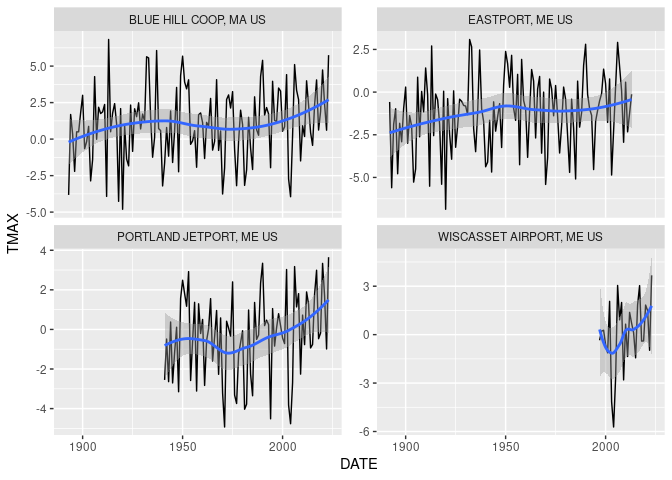
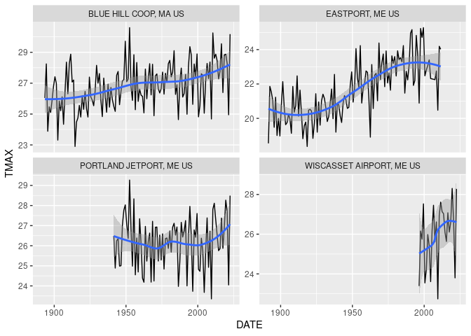
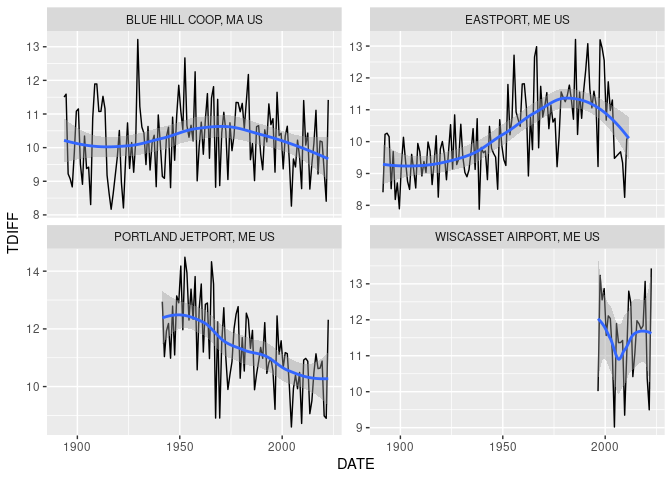

GHCNd
================

### Requirement

-   [R v4.1+](https://www.r-project.org/)

-   [rlang](https://CRAN.R-project.org/package=rlang)

-   [readr](https://CRAN.R-project.org/package=readr)

-   [sf](https://CRAN.R-project.org/package=sf)

-   [dplyr](https://CRAN.R-project.org/package=dplyr)

### Installation

From within R using
[remotes](https://CRAN.R-project.org/package=remotes)

    remotes::install_github("BigelowLab/ghncd")

### Usage

#### List the available stations

``` r
suppressPackageStartupMessages({
  library(rnaturalearth)
  library(rnaturalearthdata)
  library(charlier)
  library(ghcnd)
  library(sf)
  library(ggplot2)
  library(dplyr)
})

stations = fetch_station_list() |>
  glimpse()
```

    ## Rows: 118,492
    ## Columns: 8
    ## $ id       <chr> "ACW00011604", "ACW00011647", "AE000041196", "AEM00041194", "…
    ## $ elev     <dbl> 10.1, 19.2, 34.0, 10.4, 26.8, 264.9, 3366.0, 977.2, 1791.3, 1…
    ## $ state    <chr> NA, NA, NA, NA, NA, NA, NA, NA, NA, NA, NA, NA, NA, NA, NA, N…
    ## $ name     <chr> "ST JOHNS COOLIDGE FLD", "ST JOHNS", "SHARJAH INTER. AIRP", "…
    ## $ gsn_flag <chr> NA, NA, "GSN", NA, NA, NA, "GSN", NA, NA, NA, "GSN", "GSN", "…
    ## $ hcn_flag <chr> NA, NA, NA, NA, NA, NA, NA, NA, NA, NA, NA, NA, NA, NA, NA, N…
    ## $ wmoid    <chr> NA, NA, "41196", "41194", "41217", "41218", "40930", "40938",…
    ## $ geometry <POINT [°]> POINT (-61.7833 17.1167), POINT (-61.7833 17.1333), POI…

``` r
plot(stations['elev'], pch = "+", main = 'Elevation in meters')
```

<!-- -->

#### Get Data from one or more stations

``` r
# stations can come and go, so check that yours are in the current list
my_stations = stations |>
  dplyr::filter(id %in% 
                c('USW00014764', "USW00094623", "USC00172426", "USC00190736"))

x = fetch_station(my_stations) |>
  glimpse()
```

    ## Rows: 129,860
    ## Columns: 58
    ## $ STATION   <chr> "USC00172426", "USC00172426", "USC00172426", "USC00172426", …
    ## $ DATE      <date> 1889-09-01, 1889-09-02, 1889-09-03, 1889-09-04, 1889-09-05,…
    ## $ ELEVATION <dbl> 25.9, 25.9, 25.9, 25.9, 25.9, 25.9, 25.9, 25.9, 25.9, 25.9, …
    ## $ NAME      <chr> "EASTPORT, ME US", "EASTPORT, ME US", "EASTPORT, ME US", "EA…
    ## $ PRCP      <dbl> 0.0, 0.0, 0.0, 0.0, 0.3, 0.0, 0.0, 0.0, 0.0, 0.0, 0.0, 0.0, …
    ## $ SNOW      <dbl> NA, NA, NA, NA, NA, NA, NA, NA, NA, NA, NA, NA, NA, NA, NA, …
    ## $ SNWD      <dbl> NA, NA, NA, NA, NA, NA, NA, NA, NA, NA, NA, NA, NA, NA, NA, …
    ## $ TMAX      <dbl> 21.1, 28.3, 24.4, 25.6, 17.8, 20.6, 21.1, 21.1, 21.7, 16.1, …
    ## $ TMIN      <dbl> 12.8, 12.2, 14.4, 12.8, 10.0, 13.3, 12.2, 13.3, 12.2, 14.4, …
    ## $ AWND      <dbl> NA, NA, NA, NA, NA, NA, NA, NA, NA, NA, NA, NA, NA, NA, NA, …
    ## $ DAPR      <dbl> NA, NA, NA, NA, NA, NA, NA, NA, NA, NA, NA, NA, NA, NA, NA, …
    ## $ DASF      <dbl> NA, NA, NA, NA, NA, NA, NA, NA, NA, NA, NA, NA, NA, NA, NA, …
    ## $ MDPR      <dbl> NA, NA, NA, NA, NA, NA, NA, NA, NA, NA, NA, NA, NA, NA, NA, …
    ## $ MDSF      <dbl> NA, NA, NA, NA, NA, NA, NA, NA, NA, NA, NA, NA, NA, NA, NA, …
    ## $ TOBS      <dbl> NA, NA, NA, NA, NA, NA, NA, NA, NA, NA, NA, NA, NA, NA, NA, …
    ## $ WDFG      <dbl> NA, NA, NA, NA, NA, NA, NA, NA, NA, NA, NA, NA, NA, NA, NA, …
    ## $ WSFG      <dbl> NA, NA, NA, NA, NA, NA, NA, NA, NA, NA, NA, NA, NA, NA, NA, …
    ## $ WT01      <dbl> NA, NA, NA, NA, NA, NA, NA, NA, NA, NA, NA, NA, NA, NA, NA, …
    ## $ WT03      <dbl> NA, NA, NA, NA, NA, NA, NA, NA, NA, NA, NA, NA, NA, NA, NA, …
    ## $ WT04      <dbl> NA, NA, NA, NA, NA, NA, NA, NA, NA, NA, NA, NA, NA, NA, NA, …
    ## $ WT05      <dbl> NA, NA, NA, NA, NA, NA, NA, NA, NA, NA, NA, NA, NA, NA, NA, …
    ## $ WT06      <dbl> NA, NA, NA, NA, NA, NA, NA, NA, NA, NA, NA, NA, NA, NA, NA, …
    ## $ WT08      <dbl> NA, NA, NA, NA, NA, NA, NA, NA, NA, NA, NA, NA, NA, NA, NA, …
    ## $ WT11      <dbl> NA, NA, NA, NA, NA, NA, NA, NA, NA, NA, NA, NA, NA, NA, NA, …
    ## $ geometry  <POINT [°]> POINT (-66.99194 44.90667), POINT (-66.99194 44.90667)…
    ## $ WESD      <dbl> NA, NA, NA, NA, NA, NA, NA, NA, NA, NA, NA, NA, NA, NA, NA, …
    ## $ WT07      <dbl> NA, NA, NA, NA, NA, NA, NA, NA, NA, NA, NA, NA, NA, NA, NA, …
    ## $ WT09      <dbl> NA, NA, NA, NA, NA, NA, NA, NA, NA, NA, NA, NA, NA, NA, NA, …
    ## $ WT14      <dbl> NA, NA, NA, NA, NA, NA, NA, NA, NA, NA, NA, NA, NA, NA, NA, …
    ## $ WT16      <dbl> NA, NA, NA, NA, NA, NA, NA, NA, NA, NA, NA, NA, NA, NA, NA, …
    ## $ WT18      <dbl> NA, NA, NA, NA, NA, NA, NA, NA, NA, NA, NA, NA, NA, NA, NA, …
    ## $ ACMH      <dbl> NA, NA, NA, NA, NA, NA, NA, NA, NA, NA, NA, NA, NA, NA, NA, …
    ## $ ACSH      <dbl> NA, NA, NA, NA, NA, NA, NA, NA, NA, NA, NA, NA, NA, NA, NA, …
    ## $ FMTM      <dbl> NA, NA, NA, NA, NA, NA, NA, NA, NA, NA, NA, NA, NA, NA, NA, …
    ## $ FRGB      <dbl> NA, NA, NA, NA, NA, NA, NA, NA, NA, NA, NA, NA, NA, NA, NA, …
    ## $ FRGT      <dbl> NA, NA, NA, NA, NA, NA, NA, NA, NA, NA, NA, NA, NA, NA, NA, …
    ## $ FRTH      <dbl> NA, NA, NA, NA, NA, NA, NA, NA, NA, NA, NA, NA, NA, NA, NA, …
    ## $ GAHT      <dbl> NA, NA, NA, NA, NA, NA, NA, NA, NA, NA, NA, NA, NA, NA, NA, …
    ## $ PGTM      <dbl> NA, NA, NA, NA, NA, NA, NA, NA, NA, NA, NA, NA, NA, NA, NA, …
    ## $ PSUN      <dbl> NA, NA, NA, NA, NA, NA, NA, NA, NA, NA, NA, NA, NA, NA, NA, …
    ## $ TAVG      <dbl> NA, NA, NA, NA, NA, NA, NA, NA, NA, NA, NA, NA, NA, NA, NA, …
    ## $ TSUN      <dbl> NA, NA, NA, NA, NA, NA, NA, NA, NA, NA, NA, NA, NA, NA, NA, …
    ## $ WDF1      <dbl> NA, NA, NA, NA, NA, NA, NA, NA, NA, NA, NA, NA, NA, NA, NA, …
    ## $ WDF2      <dbl> NA, NA, NA, NA, NA, NA, NA, NA, NA, NA, NA, NA, NA, NA, NA, …
    ## $ WDF5      <dbl> NA, NA, NA, NA, NA, NA, NA, NA, NA, NA, NA, NA, NA, NA, NA, …
    ## $ WDFM      <dbl> NA, NA, NA, NA, NA, NA, NA, NA, NA, NA, NA, NA, NA, NA, NA, …
    ## $ WSF1      <dbl> NA, NA, NA, NA, NA, NA, NA, NA, NA, NA, NA, NA, NA, NA, NA, …
    ## $ WSF2      <dbl> NA, NA, NA, NA, NA, NA, NA, NA, NA, NA, NA, NA, NA, NA, NA, …
    ## $ WSF5      <dbl> NA, NA, NA, NA, NA, NA, NA, NA, NA, NA, NA, NA, NA, NA, NA, …
    ## $ WSFM      <dbl> NA, NA, NA, NA, NA, NA, NA, NA, NA, NA, NA, NA, NA, NA, NA, …
    ## $ WT02      <dbl> NA, NA, NA, NA, NA, NA, NA, NA, NA, NA, NA, NA, NA, NA, NA, …
    ## $ WT13      <dbl> NA, NA, NA, NA, NA, NA, NA, NA, NA, NA, NA, NA, NA, NA, NA, …
    ## $ WT15      <dbl> NA, NA, NA, NA, NA, NA, NA, NA, NA, NA, NA, NA, NA, NA, NA, …
    ## $ WT17      <dbl> NA, NA, NA, NA, NA, NA, NA, NA, NA, NA, NA, NA, NA, NA, NA, …
    ## $ WT19      <dbl> NA, NA, NA, NA, NA, NA, NA, NA, NA, NA, NA, NA, NA, NA, NA, …
    ## $ WT21      <dbl> NA, NA, NA, NA, NA, NA, NA, NA, NA, NA, NA, NA, NA, NA, NA, …
    ## $ WT22      <dbl> NA, NA, NA, NA, NA, NA, NA, NA, NA, NA, NA, NA, NA, NA, NA, …
    ## $ WV03      <lgl> NA, NA, NA, NA, NA, NA, NA, NA, NA, NA, NA, NA, NA, NA, NA, …

``` r
x = x |> 
  group_by(NAME)
ggplot(data = x,  aes(x=DATE, y=TMAX)) +
  geom_line() + 
  facet_wrap(~NAME, scales = 'free_y')
```

<!-- -->

The same data aggregated into monthly means. Below, we show January and
July TMAX.

``` r
m = aggregate_monthly(x) |>
  mutate(MONTH = format(DATE, "%b")) |>
  group_by(NAME) 
ggplot(data = filter(m, MONTH == "Jan"),  aes(x=DATE, y=TMAX)) +
  geom_line() + 
  geom_smooth() + 
  facet_wrap(~NAME, scales = 'free_y')
```

    ## `geom_smooth()` using method = 'loess' and formula = 'y ~ x'

<!-- -->

``` r
ggplot(data = filter(m, MONTH == "Jul"),  aes(x=DATE, y=TMAX)) +
  geom_line() + 
  geom_smooth() + 
  facet_wrap(~NAME, scales = 'free_y')
```

    ## `geom_smooth()` using method = 'loess' and formula = 'y ~ x'

<!-- -->

And it is always interesting to see how the TMX-TMIN difference changes
overtime…

``` r
m = mutate(m, TDIFF = TMAX-TMIN)

ggplot(data = filter(m, MONTH == "Jul"),  aes(x=DATE, y=TDIFF)) +
  geom_line() + 
  geom_smooth() + 
  facet_wrap(~NAME, scales = 'free_y')
```

    ## `geom_smooth()` using method = 'loess' and formula = 'y ~ x'

<!-- -->

### Inventory

GHCN provides an inventory of per station data. We provide the stations
table which allows us to transfer the station names to the inventory.

``` r
inv = fetch_inventory(stations = stations) |>
  glimpse()
```

    ## Rows: 738,180
    ## Columns: 7
    ## $ id        <chr> "ACW00011604", "ACW00011604", "ACW00011604", "ACW00011604", …
    ## $ element   <chr> "TMAX", "TMIN", "PRCP", "SNOW", "SNWD", "PGTM", "WDFG", "WSF…
    ## $ firstyear <dbl> 1949, 1949, 1949, 1949, 1949, 1949, 1949, 1949, 1949, 1949, …
    ## $ lastyear  <dbl> 1949, 1949, 1949, 1949, 1949, 1949, 1949, 1949, 1949, 1949, …
    ## $ geometry  <POINT [°]> POINT (-61.7833 17.1167), POINT (-61.7833 17.1167), PO…
    ## $ duration  <dbl> 1, 1, 1, 1, 1, 1, 1, 1, 1, 1, 1, 1, 1, 14, 14, 14, 1, 6, 80,…
    ## $ name      <chr> "ST JOHNS COOLIDGE FLD", "ST JOHNS COOLIDGE FLD", "ST JOHNS …
