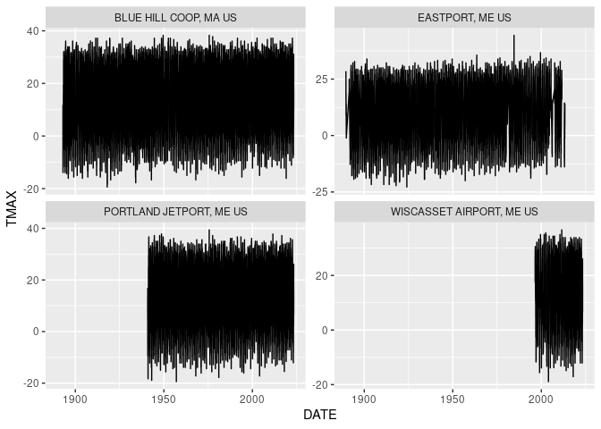

GHCNd
================

### Requirement

-   [R v4.1+](https://www.r-project.org/)

-   [rlang](https://CRAN.R-project.org/package=rlang)

-   [readr](https://CRAN.R-project.org/package=readr)

-   [sf](https://CRAN.R-project.org/package=sf)

-   [dplyr](https://CRAN.R-project.org/package=dplyr)

### Installation

From within R using
[remotes](https://CRAN.R-project.org/package=remotes)

    remotes::install_github("BigelowLab/ghncd")

### Usage

#### List the available stations

``` r
suppressPackageStartupMessages({
  library(ghcnd)
  library(sf)
  library(ggplot2)
  library(dplyr)
})

stations = fetch_station_list() |>
  glimpse()
```

    ## Rows: 118,492
    ## Columns: 8
    ## $ id       <chr> "ACW00011604", "ACW00011647", "AE000041196", "AEM00041194", "…
    ## $ elev     <dbl> 10.1, 19.2, 34.0, 10.4, 26.8, 264.9, 3366.0, 977.2, 1791.3, 1…
    ## $ state    <chr> NA, NA, NA, NA, NA, NA, NA, NA, NA, NA, NA, NA, NA, NA, NA, N…
    ## $ name     <chr> "ST JOHNS COOLIDGE FLD", "ST JOHNS", "SHARJAH INTER. AIRP", "…
    ## $ gsn_flag <chr> NA, NA, "GSN", NA, NA, NA, "GSN", NA, NA, NA, "GSN", "GSN", "…
    ## $ hcn_flag <chr> NA, NA, NA, NA, NA, NA, NA, NA, NA, NA, NA, NA, NA, NA, NA, N…
    ## $ wmoid    <chr> NA, NA, "41196", "41194", "41217", "41218", "40930", "40938",…
    ## $ geometry <POINT [°]> POINT (-61.7833 17.1167), POINT (-61.7833 17.1333), POI…

``` r
plot(stations['elev'], pch = "+", main = 'Elevation in meters')
```

<!-- -->

#### Get Data from one or more stations

``` r
x = fetch_station(c('USW00014764', "USW00094623", 
                                 "USC00172426", "USC00170100"),
                          bind = TRUE) |>
  glimpse()
```

    ## Rows: 93,783
    ## Columns: 58
    ## $ STATION   <chr> "USW00014764", "USW00014764", "USW00014764", "USW00014764", …
    ## $ DATE      <date> 1940-11-07, 1940-11-08, 1940-11-09, 1940-11-10, 1940-11-11,…
    ## $ ELEVATION <dbl> 13.5, 13.5, 13.5, 13.5, 13.5, 13.5, 13.5, 13.5, 13.5, 13.5, …
    ## $ NAME      <chr> "PORTLAND JETPORT, ME US", "PORTLAND JETPORT, ME US", "PORTL…
    ## $ PRCP      <dbl> NA, NA, NA, NA, NA, NA, NA, NA, NA, NA, NA, NA, NA, NA, NA, …
    ## $ SNOW      <dbl> NA, NA, NA, NA, NA, NA, NA, NA, NA, NA, NA, NA, NA, NA, NA, …
    ## $ SNWD      <dbl> NA, NA, NA, NA, NA, NA, NA, NA, NA, NA, NA, NA, NA, NA, NA, …
    ## $ TMAX      <dbl> 78, 100, 94, 72, 106, 128, 83, 50, 67, 72, 44, 67, 56, 128, …
    ## $ TMIN      <dbl> -11, -6, -28, -56, 22, 78, 44, 28, 33, -11, -28, -39, -67, 6…
    ## $ ACMH      <dbl> NA, NA, NA, NA, NA, NA, NA, NA, NA, NA, NA, NA, NA, NA, NA, …
    ## $ ACSH      <dbl> NA, NA, NA, NA, NA, NA, NA, NA, NA, NA, NA, NA, NA, NA, NA, …
    ## $ AWND      <dbl> NA, NA, NA, NA, NA, NA, NA, NA, NA, NA, NA, NA, NA, NA, NA, …
    ## $ FMTM      <chr> NA, NA, NA, NA, NA, NA, NA, NA, NA, NA, NA, NA, NA, NA, NA, …
    ## $ FRGB      <dbl> NA, NA, NA, NA, NA, NA, NA, NA, NA, NA, NA, NA, NA, NA, NA, …
    ## $ FRGT      <dbl> NA, NA, NA, NA, NA, NA, NA, NA, NA, NA, NA, NA, NA, NA, NA, …
    ## $ FRTH      <dbl> NA, NA, NA, NA, NA, NA, NA, NA, NA, NA, NA, NA, NA, NA, NA, …
    ## $ GAHT      <lgl> NA, NA, NA, NA, NA, NA, NA, NA, NA, NA, NA, NA, NA, NA, NA, …
    ## $ PGTM      <chr> NA, NA, NA, NA, NA, NA, NA, NA, NA, NA, NA, NA, NA, NA, NA, …
    ## $ PSUN      <dbl> NA, NA, NA, NA, NA, NA, NA, NA, NA, NA, NA, NA, NA, NA, NA, …
    ## $ TAVG      <dbl> NA, NA, NA, NA, NA, NA, NA, NA, NA, NA, NA, NA, NA, NA, NA, …
    ## $ TOBS      <dbl> NA, NA, NA, NA, NA, NA, NA, NA, NA, NA, NA, NA, NA, NA, NA, …
    ## $ TSUN      <dbl> NA, NA, NA, NA, NA, NA, NA, NA, NA, NA, NA, NA, NA, NA, NA, …
    ## $ WDF1      <dbl> NA, NA, NA, NA, NA, NA, NA, NA, NA, NA, NA, NA, NA, NA, NA, …
    ## $ WDF2      <dbl> NA, NA, NA, NA, NA, NA, NA, NA, NA, NA, NA, NA, NA, NA, NA, …
    ## $ WDF5      <dbl> NA, NA, NA, NA, NA, NA, NA, NA, NA, NA, NA, NA, NA, NA, NA, …
    ## $ WDFG      <dbl> NA, NA, NA, NA, NA, NA, NA, NA, NA, NA, NA, NA, NA, NA, NA, …
    ## $ WDFM      <dbl> NA, NA, NA, NA, NA, NA, NA, NA, NA, NA, NA, NA, NA, NA, NA, …
    ## $ WESD      <dbl> NA, NA, NA, NA, NA, NA, NA, NA, NA, NA, NA, NA, NA, NA, NA, …
    ## $ WSF1      <dbl> NA, NA, NA, NA, NA, NA, NA, NA, NA, NA, NA, NA, NA, NA, NA, …
    ## $ WSF2      <dbl> NA, NA, NA, NA, NA, NA, NA, NA, NA, NA, NA, NA, NA, NA, NA, …
    ## $ WSF5      <dbl> NA, NA, NA, NA, NA, NA, NA, NA, NA, NA, NA, NA, NA, NA, NA, …
    ## $ WSFG      <dbl> NA, NA, NA, NA, NA, NA, NA, NA, NA, NA, NA, NA, NA, NA, NA, …
    ## $ WSFM      <dbl> NA, NA, NA, NA, NA, NA, NA, NA, NA, NA, NA, NA, NA, NA, NA, …
    ## $ WT01      <dbl> NA, NA, NA, NA, NA, NA, NA, NA, NA, NA, NA, NA, NA, NA, NA, …
    ## $ WT02      <dbl> NA, NA, NA, NA, NA, NA, NA, NA, NA, NA, NA, NA, NA, NA, NA, …
    ## $ WT03      <dbl> NA, NA, NA, NA, NA, NA, NA, NA, NA, NA, NA, NA, NA, NA, NA, …
    ## $ WT04      <dbl> NA, NA, NA, NA, NA, NA, NA, NA, NA, NA, NA, NA, NA, NA, NA, …
    ## $ WT05      <dbl> NA, NA, NA, NA, NA, NA, NA, NA, NA, NA, NA, NA, NA, NA, NA, …
    ## $ WT06      <dbl> NA, NA, NA, NA, NA, NA, NA, NA, NA, NA, NA, NA, NA, NA, NA, …
    ## $ WT07      <dbl> NA, NA, NA, NA, NA, NA, NA, NA, NA, NA, NA, NA, NA, NA, NA, …
    ## $ WT08      <dbl> NA, NA, NA, NA, NA, NA, NA, NA, NA, NA, NA, NA, NA, NA, NA, …
    ## $ WT09      <dbl> NA, NA, NA, NA, NA, NA, NA, NA, NA, NA, NA, NA, NA, NA, NA, …
    ## $ WT11      <dbl> NA, NA, NA, NA, NA, NA, NA, NA, NA, NA, NA, NA, NA, NA, NA, …
    ## $ WT13      <dbl> NA, NA, NA, NA, NA, NA, NA, NA, NA, NA, NA, NA, NA, NA, NA, …
    ## $ WT14      <dbl> NA, NA, NA, NA, NA, NA, NA, NA, NA, NA, NA, NA, NA, NA, NA, …
    ## $ WT15      <dbl> NA, NA, NA, NA, NA, NA, NA, NA, NA, NA, NA, NA, NA, NA, NA, …
    ## $ WT16      <dbl> NA, NA, NA, NA, NA, NA, NA, NA, NA, NA, NA, NA, NA, NA, NA, …
    ## $ WT17      <dbl> NA, NA, NA, NA, NA, NA, NA, NA, NA, NA, NA, NA, NA, NA, NA, …
    ## $ WT18      <dbl> NA, NA, NA, NA, NA, NA, NA, NA, NA, NA, NA, NA, NA, NA, NA, …
    ## $ WT19      <dbl> NA, NA, NA, NA, NA, NA, NA, NA, NA, NA, NA, NA, NA, NA, NA, …
    ## $ WT21      <dbl> NA, NA, NA, NA, NA, NA, NA, NA, NA, NA, NA, NA, NA, NA, NA, …
    ## $ WT22      <dbl> NA, NA, NA, NA, NA, NA, NA, NA, NA, NA, NA, NA, NA, NA, NA, …
    ## $ WV03      <lgl> NA, NA, NA, NA, NA, NA, NA, NA, NA, NA, NA, NA, NA, NA, NA, …
    ## $ geometry  <POINT [°]> POINT (-70.30443 43.64244), POINT (-70.30443 43.64244)…
    ## $ DAPR      <dbl> NA, NA, NA, NA, NA, NA, NA, NA, NA, NA, NA, NA, NA, NA, NA, …
    ## $ DASF      <dbl> NA, NA, NA, NA, NA, NA, NA, NA, NA, NA, NA, NA, NA, NA, NA, …
    ## $ MDPR      <dbl> NA, NA, NA, NA, NA, NA, NA, NA, NA, NA, NA, NA, NA, NA, NA, …
    ## $ MDSF      <dbl> NA, NA, NA, NA, NA, NA, NA, NA, NA, NA, NA, NA, NA, NA, NA, …

``` r
x = mutate(x,TMIN = TMIN/10,TMAX = TMAX/10) |>
         group_by(NAME)
ggplot(data = x,  aes(x=DATE, y=TMAX)) +
  geom_line() + 
  facet_wrap(~NAME, scales = 'free_y')
```

<!-- -->
